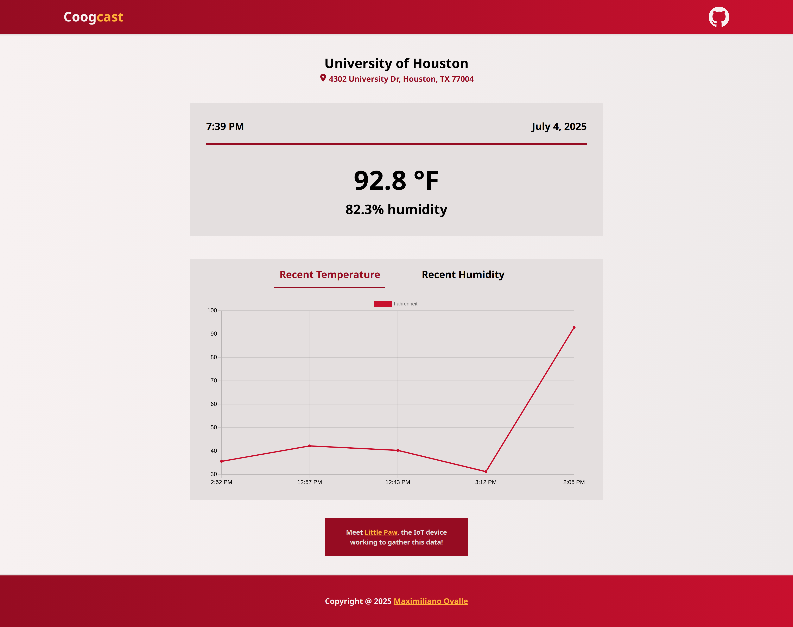

<!-- PROJECT LOGO -->
 

  

  <h3 align="center">Coogcast</h3>

  

    University of Houston's current temperature and humidity tracked hourly with "<a href="https://github.com/maximilianovalle/little-paw" target="_blank" rel="noopener noreferrer">Little Paw</a>"! Check out the data real-time at <a href="https://coogcast.com" target="_blank" rel="noopener noreferrer">Coogcast.com</a>! <strong>Note:</strong> sometimes the data may take a few minutes to display properly due to Coogcast being deployed on free services! If you see "--" instead of true temperature or humidity values, please allow some time for the site to fully render!
      
    <a href="https://github.com/maximilianovalle/coogcast/issues/new">Report Bug</a>
    &middot;
    <a href="https://github.com/maximilianovalle/coogcast/issues/new">Request Feature</a>
  

<!-- TABLE OF CONTENTS -->

  
Table of Contents

  <ol>
    <li>
      <a href="#about-the-project">About The Project</a>
      <ul>
        <li><a href="#built-with">Built With</a></li>
      </ul>
    </li>
    <li><a href="#roadmap">Roadmap</a></li>
    <li><a href="#license">License</a></li>
    <li><a href="#contact">Contact</a></li>
    <li><a href="#acknowledgments">Acknowledgments</a></li>
  </ol>

<!-- ABOUT THE PROJECT -->
## About The Project

There are a ton of weather and climate websites out there, but how many of them use their own robot to get their data? Probably a lot, but here's another one!

Coogcast displays the most recent data retrieved by Little Paw, as well as some graphs to help you visualize the data collected in the past few hours. Moved back home for the summer? Missing campus? Coogcast can help you feel a little closer to school - by making you remember all those sweaty treks to class you used to make! Phew! At least you're not back at UH in this weather!

(<a href="#readme-top">back to top</a>)

### Built With

* [![Vite][Vite]][Vite-url]
* [![React][React.js]][React-url]
* [![Express][Express.js]][Express-url]
* [![PostgreSQL][PostgreSQL]][PostgreSQL-url]

(<a href="#readme-top">back to top</a>)

<!-- ROADMAP -->
## Roadmap

- [ ] Fix darkmode CSS styling
- [ ] Connect Little Paw to backend + database

See the [open issues](https://github.com/maximilianovalle/coogcast/issues) for a full list of proposed features (and known issues).

(<a href="#readme-top">back to top</a>)

<!-- LICENSE -->
## License

Distributed under the Unlicense License. See `LICENSE.txt` for more information.

(<a href="#readme-top">back to top</a>)

<!-- CONTACT -->
## Contact

Maximiliano Ovalle - maximiliano.j.ovalle@gmail.com  
Project Link: [https://github.com/maximilianovalle/coogcast](https://github.com/maximilianovalle/coogcast)

(<a href="#readme-top">back to top</a>)

<!-- ACKNOWLEDGMENTS -->
## Acknowledgments

* [How to Create a Express/Node + React Project with Vite](https://www.youtube.com/watch?v=mKmxc8TcWQ8&ab_channel=ArpanNeupane)
* [Learn React ChartJS in 8 Minutes](https://www.youtube.com/watch?v=6q5d3Z1-5kQ&ab_channel=CodeComplete)
* [React Icons](https://react-icons.github.io/react-icons/search)
* [University of Houston Brand Style Guide](https://uh.edu/brand/brand-identity/style-guide/)
* [Connect with pgAdmin](https://aiven.io/docs/products/postgresql/howto/connect-pgadmin)
* [Connect with NodeJS](https://aiven.io/docs/products/postgresql/howto/connect-node)
* [Deploy your MERN app (Node & React) to Render & Netlify](https://www.youtube.com/watch?v=o_UtxjDYb78)

(<a href="#readme-top">back to top</a>)

<!-- MARKDOWN LINKS & IMAGES -->
<!-- https://www.markdownguide.org/basic-syntax/#reference-style-links -->
[contributors-shield]: https://img.shields.io/github/contributors/othneildrew/Best-README-Template.svg?style=for-the-badge
[contributors-url]: https://github.com/othneildrew/Best-README-Template/graphs/contributors
[forks-shield]: https://img.shields.io/github/forks/othneildrew/Best-README-Template.svg?style=for-the-badge
[forks-url]: https://github.com/othneildrew/Best-README-Template/network/members
[stars-shield]: https://img.shields.io/github/stars/othneildrew/Best-README-Template.svg?style=for-the-badge
[stars-url]: https://github.com/othneildrew/Best-README-Template/stargazers
[issues-shield]: https://img.shields.io/github/issues/othneildrew/Best-README-Template.svg?style=for-the-badge
[issues-url]: https://github.com/othneildrew/Best-README-Template/issues
[license-shield]: https://img.shields.io/github/license/othneildrew/Best-README-Template.svg?style=for-the-badge
[license-url]: https://github.com/othneildrew/Best-README-Template/blob/master/LICENSE.txt
[linkedin-shield]: https://img.shields.io/badge/-LinkedIn-black.svg?style=for-the-badge&logo=linkedin&colorB=555
[linkedin-url]: https://linkedin.com/in/othneildrew

[React.js]: https://img.shields.io/badge/React-20232A?style=for-the-badge&logo=react&logoColor=61DAFB
[React-url]: https://reactjs.org/
[Vite]: https://img.shields.io/badge/Vite-646CFF?style=for-the-badge&logo=Vite&logoColor=white
[Vite-url]: https://vite.dev/
[Express.js]: https://img.shields.io/badge/express.js-000000?style=for-the-badge&logo=express&logoColor=white
[Express-url]: https://expressjs.com/
[PostgreSQL]: https://img.shields.io/badge/postgresql-4169e1?style=for-the-badge&logo=postgresql&logoColor=white
[PostgreSQL-url]: https://www.postgresql.org/